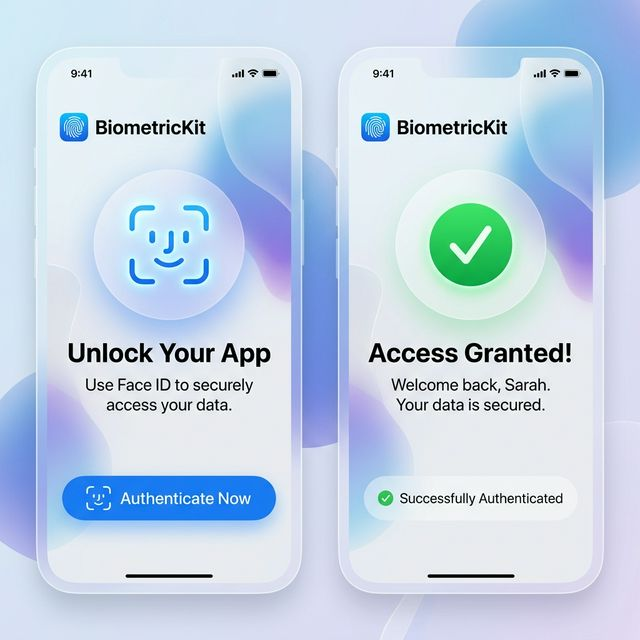

# BiometricKit

A simple, modern, and SwiftUI-first wrapper for Face ID, Touch ID, and Optic ID.



## Features
- **Zero Boilerplate**: Easy async/await authentication.
- **SwiftUI Ready**: Integrated View Modifiers for clean code.
- **Auto-Handled**: Transparently handles context and policy evaluation.
- **Safe**: Clean `BiometricResult` enum for success and error states.

## Supported Platforms
- iOS 14.0+
- macOS 11.0+

## Setup (Info.plist)

You must add the `NSFaceIDUsageDescription` key to your `Info.plist` to support Face ID:

```xml
<key>NSFaceIDUsageDescription</key>
<string>This app requires Face ID to securely unlock your content.</string>
```

## Installation

```swift
.package(url: "https://github.com/ErsanQ/BiometricKit", from: "1.0.0")
```

## Usage

### Using SwiftUI Modifier

```swift
import SwiftUI
import BiometricKit

struct SecureView: View {
    @State private var showAuth = false
    
    var body: some View {
        Button("Unlock Content") {
            showAuth = true
        }
        .onBiometricAuth(isPresented: $showAuth, reason: "Unlock your sensitive data") { result in
            switch result {
            case .success:
                print("Access Granted!")
            case .failure(let error):
                print("Error: \(error.localizedDescription)")
            }
        }
    }
}
```

### Manual Request (Async/Await)

```swift
import BiometricKit

let result = await BiometricManager.shared.authenticate(reason: "Login to account")
if case .success = result {
    // Proceed
}
```

## Author
ErsanQ (Swift Package Index Community)
